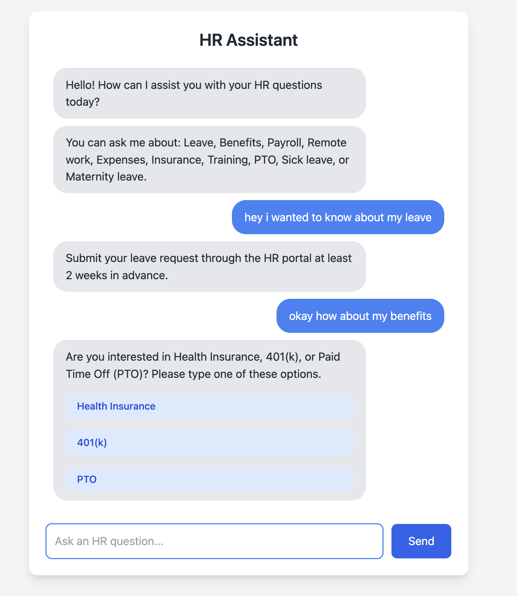

# HR Assistant Bot\n\nA simple, interactive HR assistant bot built with Flask and a clean web interface.\n\n## Features\n\n*   **Interactive Chat Interface:** Clean and responsive web interface for employees to ask questions.\n*   **FAQ Knowledge Base:** Stores frequently asked questions and answers in an easy-to-update `faq.json` file.\n*   **Keyword Matching:** Uses keyword matching to understand user queries and provide relevant answers.\n*   **Follow-up Questions:** Supports basic multi-turn conversations with predefined follow-up questions for certain topics (e.g., Benefits).\n*   **Easy FAQ Updates:** Update the bot's knowledge by simply modifying the `faq.json` file without changing the core code.\n\n## Getting Started\n\nThese instructions will help you set up and run the project locally.\n\n### Prerequisites\n\n*   Python 3.6+\n*   Git\n*   (Optional for deployment) Heroku CLI\n\n### Installation\n\n1.  **Clone the repository:**\n\t```bash\n\tgit clone <repository_url>\n\tcd hr-bot\n\t```\n\t(Replace `<repository_url>` with the actual URL of your Git repository.)\n\n2.  **Set up a virtual environment (recommended):**\n\t```bash\n\tpython -m venv venv\n\t# On macOS/Linux:\n\tsource venv/bin/activate\n\t# On Windows:\n\t.\\venv\\Scripts\\activate\n\t```\n\n3.  **Install dependencies:**\n\t```bash\n\tpip install -r requirements.txt\n\t```\n\n### Running the Application\n\n1.  **Make sure your virtual environment is active.**\n\n2.  **Run the Flask application:**\n\t```bash\n\tpython app.py\n\t```\n\n\tThe application will start, and you can access it in your web browser at `http://127.0.0.1:5000`.\n\n## Updating FAQs\n\nThe bot's knowledge base is stored in the `faq.json` file in the root directory.\n\n*   Each entry in the JSON array represents a question and its answer(s).\n*   `keywords`: A list of words or phrases that will trigger this FAQ entry.\n*   `question`: (Optional) A representative question for the entry.\n*   `answer`: The initial answer provided by the bot.\n*   `follow_up`: (Optional) An object defining follow-up questions and options:\n    *   `question`: The text of the follow-up question.\n    *   `options`: A list of strings representing the choices the user can make.\n    *   `next_step`: An object mapping lowercased option keywords to the detailed answers.\n\nTo add or update FAQs, simply edit the `faq.json` file. If you are running the app in debug mode (`debug=True` in `app.py`), changes to `faq.json` should be automatically reloaded.\n\n## Deployment\n\nThe simplest way to deploy this Flask application is using Heroku.\n\n1.  **Ensure your project is in a Git repository.**\n\n2.  **Log in to Heroku CLI:**\n\t```bash\n\theroku login\n\t```\n\n3.  **Create a new Heroku app:**\n\t```bash\n\theroku create your-app-name\n\t```\n\t(Replace `your-app-name` or omit to get a random name.)\n\n4.  **Push your code to Heroku:**\n\t```bash\n\tgit push heroku main\n\t```\n\t(Use `master` instead of `main` if that's your branch name.)\n\nHeroku will use the `Procfile` (`web: gunicorn app:app`) and `requirements.txt` to build and run your application.\n\n## Screenshot\n\nHere's a look at the HR Assistant bot interface:\n\n 